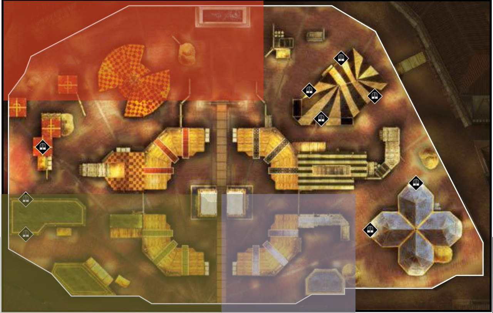
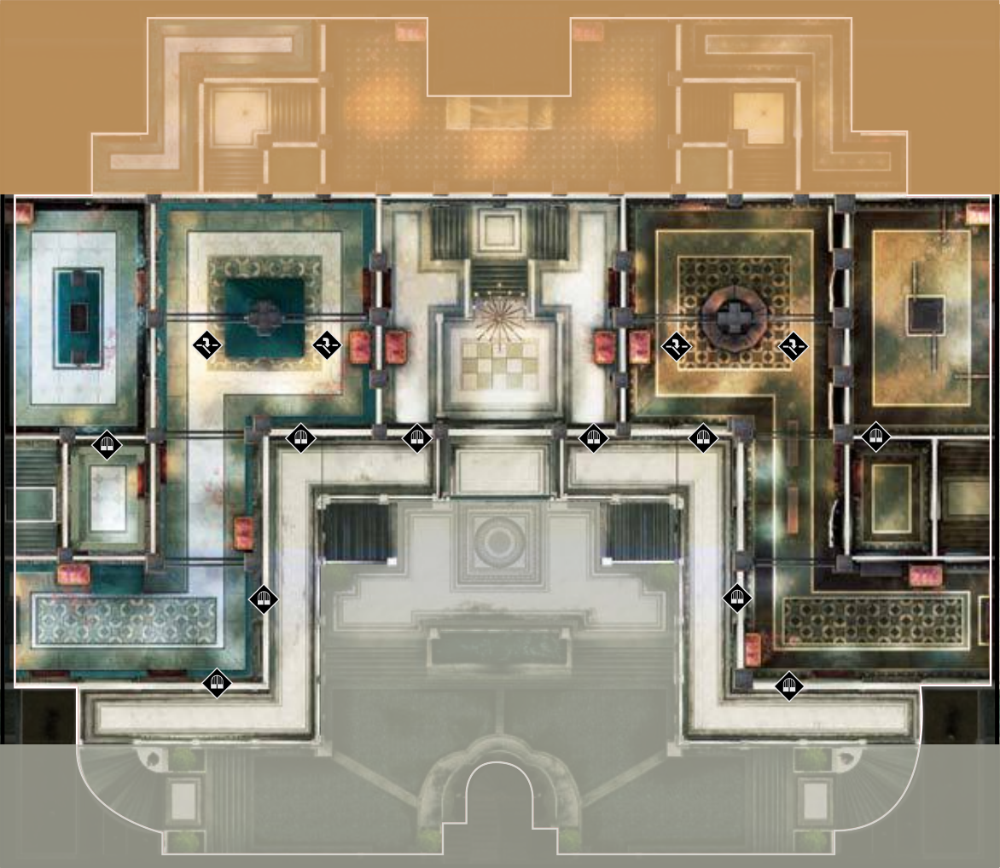
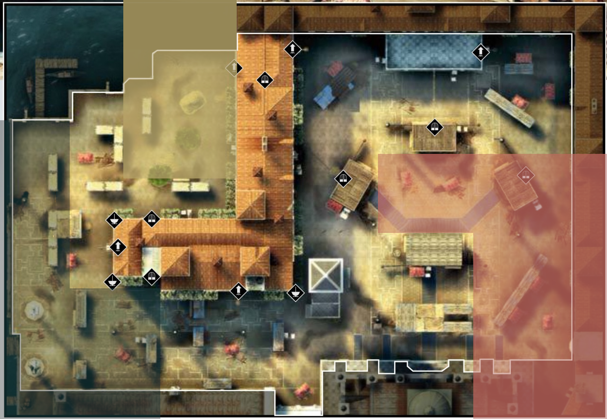
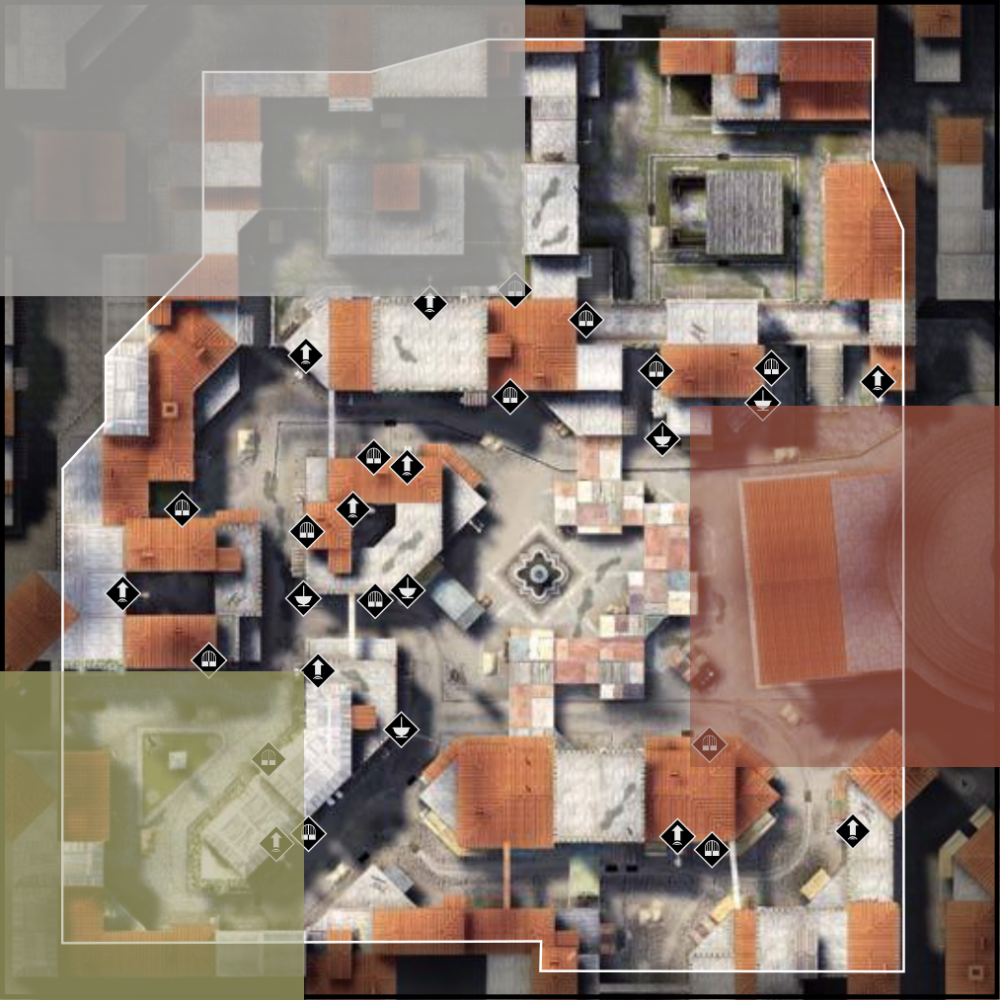

# 7. Manhunt: Point Starving

The following are two separate definitions of point starving. It is up to the tournament organizers to specify which definition is used for their specific tournament. If no definition is specified, the death-based definition is used.

## Stun-based Definition

Once a player is walled up, they cannot exit the wall spot until they get at least one stun.

## Death-based Definition

If three or more players are grouped up\*, none of these players can run to another spot unless their teammates they were grouped with died and only they are left alive.  
  
\* In the case of 2v2s, both players have to be grouped up together. For 1v1s, the stun-based definition is used.

## Consequences

If point starving takes place, proof must be handed over to the tournament officials, who will determine its impact on the outcome of the game. Depending on the severity of the point starving, the equation described in 5. Remakes may be used to determine whether the game must be remade:



## "Spots" on Manhunt Maps

So called "wall spots" or "blend spots" are loosely defined here. Each block of color represents a different blend spot, i.e. one cannot move from color A to color B if one does not fullfill the requirements according to the point starving definition.

### Siena

### Castel Gandolfo

### Venice

### Rome

### San Donato

