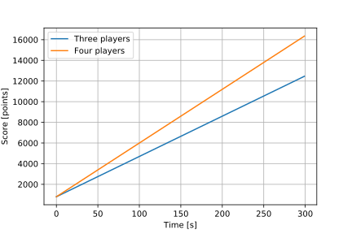

# Remakes

This page explains whether a game should be remade when a player gets stuck in a glitch they cannot get out of or disconnects. Exceptions can be made when necessary. These are simply guidlelines.

The variables used in the following equations are defined as:

$$
s = \mathrm{score} \\
t = \mathrm{time} \\
p = \mathrm{players}
$$

## Manhunt

A game is always remade if a player disconnects or gets glitched in the first round. For the second round, the equation that determines the required score difference for  a manhunt game to be remade is:

$$
s_\mathrm{required} = 13\,\mathrm{\frac{points}{seconds}} \times t \times p +  800\,\mathrm{points}
$$

If the score difference is higher than the calculated required score difference, the game is not remade. If it is equal to or less, the game is remade.

## Escort

The equation to determine whether an escort game should be remade is as follows:

$$
\LaTeX
$$

## Assassinate

In assassinate, the glitch where a poisoned player receives their poisoner only constitutes a remake when the two affected players are in first and second place and the score difference at the end of the game is less than or equal to the points made by the non-poison kill with the streak bonus on the poison kill subtracted if applicable:

$$
| p_\mathrm{player1} - p_\mathrm{player2} | \leq | p_\mathrm{poison} - p_\mathrm{streak} |
$$

For glitches in which someone gets stuck, the following equation determines whether an assassinate game should be remade:

$$
\LaTeX
$$

